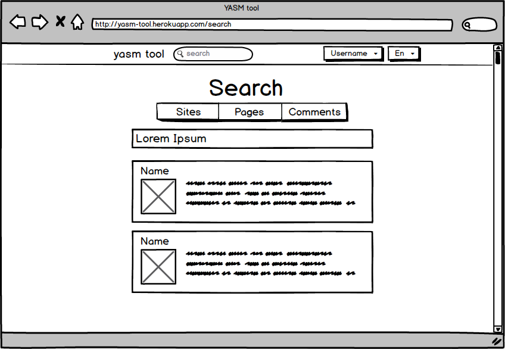
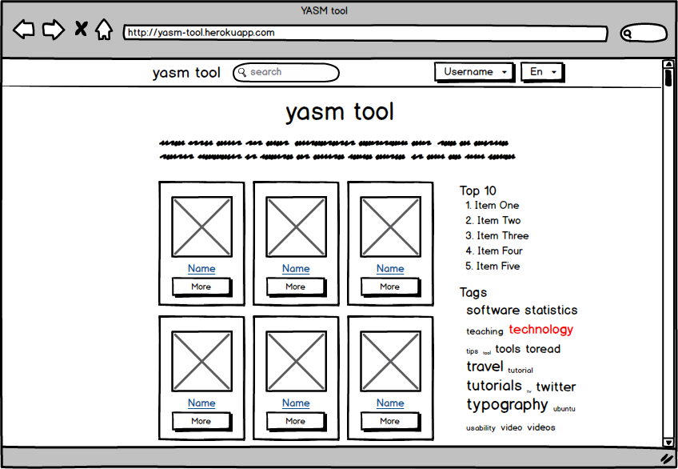
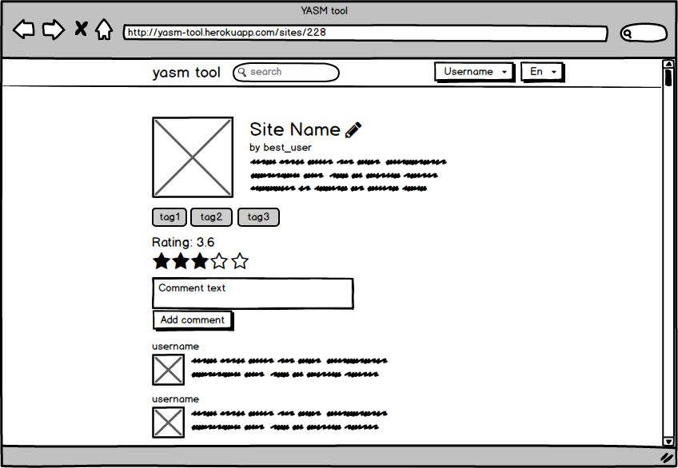
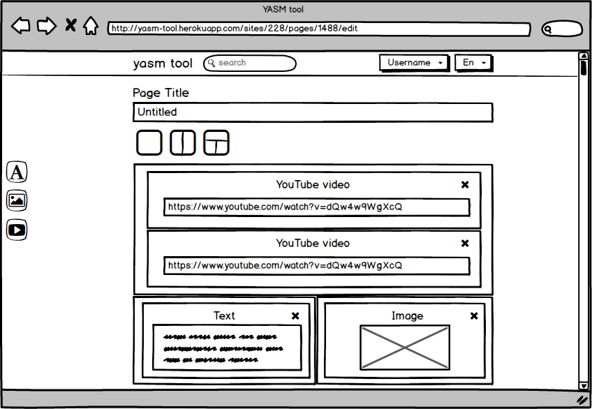

# Требования к проекту

## 1. Введение

Название проекта “YASM tool”. Проект представляет собой 
веб-сайт для создания пользователем собственных сайтов с
элементами коммуникации между пользователями.

## 2. Требования пользователя

### Программные интерфейсы

* Фреймворки:
  * Ruby on Rails
  * Bootstrap
* Базы данных:
  * PostgreSQL
  * Active Record ORM
* Языки программирования:
  * Ruby
  * Javascript
	
### 2.2 Интерфейс пользователя

Описание взаимодействия пользователя с веб-сайтом приведено
в виде иллюстраций в приложении. 

### 2.3 Характеристики пользователей 

Группы пользователей:

* Гости
* Аутентифицированные пользователи
* Администраторы

### 2.4 Предположения и зависимости 

1. Ограниченное дисковое пространство сервера. 

## 3. Системные требования

### 3.1 Функциональные требования

* Возможности у незарегистрированных пользователей:
	* Просмотр описания сайтов
	* Просмотр пользовательских сайтов
	* Поиск

* Главная страница с обзором всех сайтов, топами и облаком тегов

* Возможность у администраторов управления контентом и пользователями на специальном разделе сайта
* Страница с описанием сайта

* Редактор сайтов
  * Создание
  * Удаление
  * Редактирование
  * Пользователь задаёт:
    * Название
    * Описание
    * Набор тегов
    * Стиль
    * Логотип
  * У каждой страницы сайта есть
    * Название
    * Один из шаблонов расположения контента:
      * Сплошной, без разделения
      * Две колонки
      * Т-образное разделение

  * Перетаскиваниями можно добавлять контент:
    * Текст (Markdown)
    * Видео
    * Изображения (c возможностью выбирать изображения из ранее загруженных)
  * У каждого элемента есть опции
* Каждый зарегистрированный пользователь может выставлять сайту рейтинг и комментации
* Награды пользователям
* Страницы регистрации и входа.
		
### 3.2 Нефункциональные требования

#### 3.2.1 Атрибуты качества

* Адаптивный дизайн, так как в данный момент наблюдается тенденция увеличения доли мобильных устройств в сети Интернет
